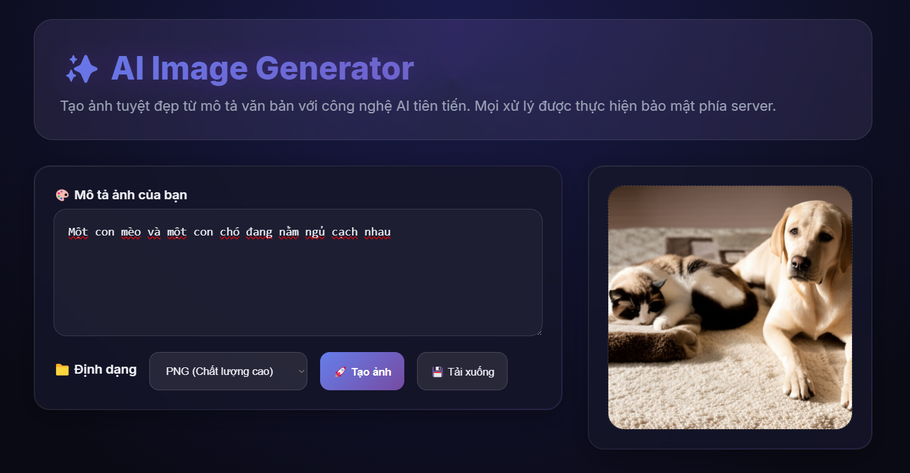
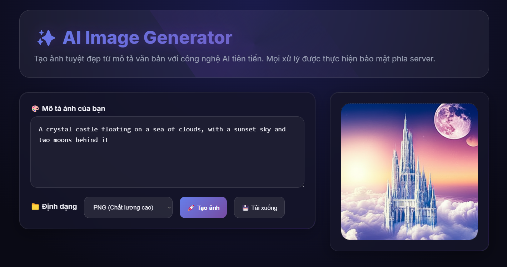

# 🖼️ Text-to-Image with Latent Diffusion & DiT

Dự án nghiên cứu và triển khai mô hình **Text-to-Image (T2I)** dựa trên kiến trúc **Latent Diffusion Model (LDM)** kết hợp với **Diffusion Transformer (DiT)**.  
Mục tiêu là xây dựng mô hình sinh ảnh chất lượng cao từ văn bản **song ngữ Việt/Anh**, có khả năng mở rộng và suy luận nhanh.

---

## 🔑 Điểm nổi bật
- **Latent Diffusion**: huấn luyện trên không gian latent (VAE) → tiết kiệm compute.  
- **Diffusion Transformer (DiT)**: thay UNet bằng Transformer để scale tốt hơn.  
- **Text Encoder SigLIP/CLIP Multilingual**: hỗ trợ prompt tiếng Việt và tiếng Anh.  
- **Classifier-Free Guidance (CFG)**: nâng cao độ khớp giữa ảnh và prompt.  
- **Sampler nhanh**: DPM-Solver++, Euler A (15–30 bước).  
- **Hỗ trợ distillation**: suy luận nhanh với 8–12 bước.  

---

## 📐 Kiến trúc mô hình

- **VAE**: nén ảnh → latent `z` (H/8 × W/8 × 4), decode ngược khi sinh ảnh.  
- **Text Encoder**: SigLIP/CLIP multilingual → embedding cho prompt.  
- **Diffusion Core (DiT)**:
  - Patch latent thành chuỗi tokens.  
  - Thêm timestep embedding.  
  - Cross-attention với text embeddings.  
  - AdaLN/FiLM để điều kiện hoá.  
- **Loss**: v-prediction (ổn định hơn ε-pred).  

---

## 📂 Cấu trúc repo

    t2i/
      configs/
        dit_b_256.yaml
        dit_b_512.yaml
      data/
        webdataset_shards/...
      models/
        vae.py
        text_encoder.py
        dit.py
        noise_scheduler.py
      train/
        dataset.py
        losses.py
        engine.py
        eval.py
      infer/
        sampler.py
        pipeline.py
      scripts/
        prepare_data.py
        train_256.sh
        finetune_512.sh
        sample.py

---

## 📦 Cài đặt
    conda create -n t2i python=3.10 -y
    conda activate t2i
    pip install torch torchvision --index-url https://download.pytorch.org/whl/cu121
    pip install -r requirements.txt

---

## 🛠️ Chuẩn bị dữ liệu

1. Tải tập **text-image** (VD: LAION, dữ liệu crawl riêng).  
2. Lọc dữ liệu:
   - CLIP similarity > threshold.  
   - Aesthetic predictor > 5.  
   - Loại NSFW / caption rác.  
3. Augmentation:
   - Song ngữ: prompt tiếng Việt + tiếng Anh.  
   - Resize + bucketing (512×512, 640×448, 448×640…).  
   - Lưu ở dạng **WebDataset shards** (.tar).  

---

## 🚀 Huấn luyện

### Giai đoạn A: Pretrain 256px
    bash scripts/train_256.sh

- Batch size hiệu dụng: 1k–8k.  
- Optimizer: AdamW (lr=1e-4, cosine decay).  
- EMA decay: 0.9999.  

### Giai đoạn B: Finetune 512px
    bash scripts/finetune_512.sh

- Unfreeze nhẹ LN cuối của text encoder.  
- Có thể unfreeze decoder VAE vài epoch cuối.  

---

## 🎨 Suy luận

    from infer.pipeline import generate_image
    
    prompt = "Một cô gái đang đọc sách trong quán cà phê phong cách cổ điển"
    images = generate_image(
        prompt=prompt,
        sampler="dpmpp",
        steps=20,
        guidance_scale=5.0,
        seed=42
    )
    images[0].save("output.png")

---

## 📊 Đánh giá mô hình

- **FID/KID**: đo độ giống dữ liệu thật (COCO subset).  
- **CLIPScore**: độ khớp prompt-ảnh.  
- **PickScore**: chất lượng ảnh theo aesthetic.  
- **Prompt Suite**: PartiPrompts, DrawBench + bộ prompt tiếng Việt.  

---

## ⚡ Tối ưu hoá suy luận

- DPM-Solver++ ~20 bước.  
- Distillation/rectified flow ~8 bước.  
- Export ONNX/TensorRT cho server.  

## 🚀 Demo (coming soon)

